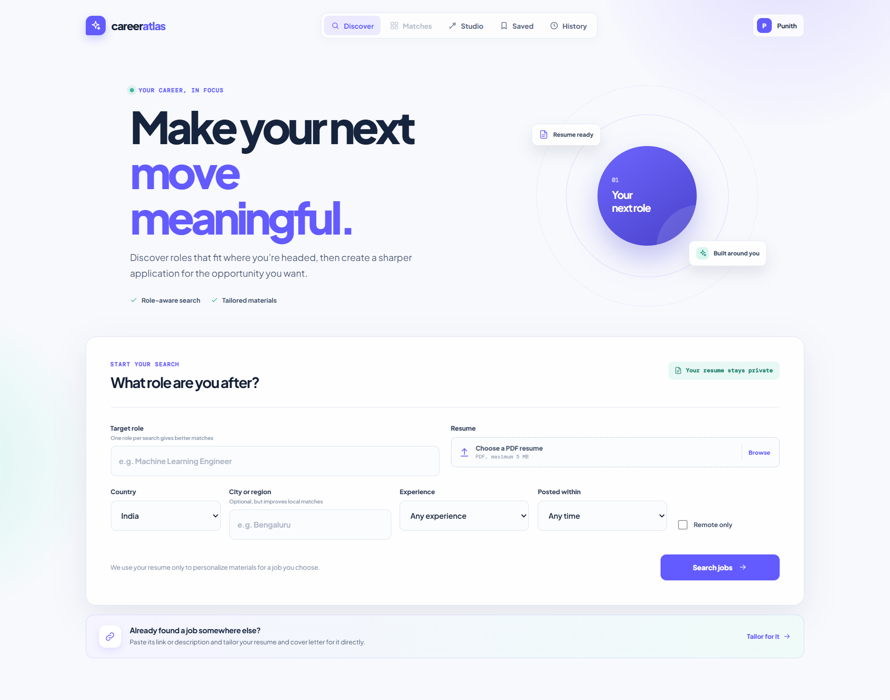

# CareerAtlas

**Resume-aware job search with AI-tailored application materials.**

Upload a PDF resume, pick a target role, and CareerAtlas finds live job listings,
ranks them against what your resume actually shows, and generates a skill-gap
analysis, a tailored resume, and a cover letter for whichever job you choose.

> **Live demo:** _add your Vercel URL here after deploying_


<!-- Screenshots to add:
     docs/screenshots/search.png     - the Discover / search screen
     docs/screenshots/matches.png    - ranked job cards with match scores
     docs/screenshots/studio.png     - the tailoring workspace
     docs/screenshots/saved.png      - saved jobs page
-->

---

## Features

**Resume-aware ranking.** There is no hard-coded skill list. Gemini reads the
resume and extracts a candidate profile — real job titles, skills, industries,
seniority — and every listing is scored against it. Each job card shows a match
score, matched skills, missing skills, and a short explanation. If Gemini is
unavailable or rate-limited, a deterministic fallback ranking takes over so the
app never dead-ends.

**Live job search.** One target role at a time, filtered by country, city,
experience level, remote preference, and how recently the job was posted.

**AI tailoring studio.** For a selected job, generate a skill-gap analysis, a
tailored resume, or a cover letter — each independently, so you only spend API
calls on what you want.

**PDF export in your own resume's style.** Download any of the three documents as
a clean, text-based PDF that stays readable by applicant tracking systems. The
tailored resume and cover letter are rebuilt in the look of the resume you
uploaded: its fonts (using metric-compatible stand-ins such as Carlito for
Calibri and Tinos for Times New Roman), sizes, colours, name alignment, heading
rules, and line spacing, fitted to the same number of pages. The style is read
directly from the PDF, with no AI request. Graphics, icons, and multi-column
layouts are not reproduced. The PDF library and fonts load only when first used,
so they add nothing to the initial page load.

**Bring your own job.** Found a posting on another site? Paste its link and
CareerAtlas reads the job details — from the page's structured job data when it
has any, otherwise with Gemini — or paste the description yourself. Attach a
resume and tailor for it like any other job.

**Accounts, saved jobs, and history.** Sign up to bookmark roles and keep a
snapshot of every search you run, reopenable later without spending another
search credit. The app stays fully usable as a guest: search, ranking, and
tailoring all work without an account.

**Your resume is never stored.** The PDF is parsed in memory and discarded. No
resume file or extracted text is written to the database.

## Tech stack

| Layer | Choice |
| --- | --- |
| Frontend | React 19 + Vite, plain CSS with design tokens |
| Backend | FastAPI, LangGraph agent workflow |
| AI | Google Gemini 3.5 Flash Lite (JSON mode) |
| Jobs data | JSearch (RapidAPI) |
| Auth + database | Supabase (Postgres with Row Level Security) |
| Hosting | Vercel (frontend), Render (backend), Supabase (data) |

## Architecture

```
Browser (React)
   |
   |-- Supabase  ......  auth, saved jobs, search history (RLS: users see only their own rows)
   |
   +-- FastAPI backend
          |-- pypdf ..........  extract resume text (in memory, never stored)
          |-- JSearch ........  fetch live listings
          |-- job links ......  read postings pasted in by the user (JSON-LD first, then Gemini)
          +-- Gemini .........  candidate profile, ranking, tailored materials
```

The backend holds the paid API keys. The browser never sees them.

---

## Local setup

### Prerequisites

- Git
- Python 3.12 (3.10+ works; 3.12 matches the deployed version)
- Node.js 20+ and npm
- A free [Google AI Studio](https://aistudio.google.com/) key (Gemini)
- A free [JSearch on RapidAPI](https://rapidapi.com/letscrape-6bRBa3QguO5/api/jsearch) key
- A free [Supabase](https://supabase.com) project (only needed for accounts)

### 1. Clone

```bash
git clone <your-repo-url>
cd Multi-Agent-Job-Search
```

### 2. Backend

```bash
cd backend
python -m venv venv

# Windows
venv\Scripts\activate
# macOS / Linux
source venv/bin/activate

pip install -r requirements.txt
cp .env.example .env      # then open .env and paste your keys
python api.py
```

Backend runs at http://localhost:8000. Check http://localhost:8000/health.

### 3. Frontend

In a second terminal:

```bash
cd frontend
npm install
cp .env.example .env      # then open .env and paste your Supabase values
npm run dev
```

Frontend runs at http://localhost:5173.

### 4. Supabase

Follow [`supabase/SETUP.md`](supabase/SETUP.md): create the project, run
[`supabase/schema.sql`](supabase/schema.sql) in the SQL editor, enable
email/password auth, and copy the two values into `frontend/.env`.

Leave the Supabase variables blank and the app still runs — just without
accounts, saved jobs, or history.

### Developing without spending API credits

Set `MOCK_MODE=true` in `backend/.env` to get sample listings and sample
analyses without calling JSearch or Gemini. Useful for UI work.

---

## Environment variables

### `backend/.env` — secret, server-side only

| Variable | Required | Purpose |
| --- | --- | --- |
| `GEMINI_API_KEY` | yes | Google Gemini key. `GOOGLE_API_KEY` also works. |
| `RAPIDAPI_KEY` | yes | JSearch key for live listings. |
| `FRONTEND_ORIGINS` | production | Comma-separated frontend URLs allowed by CORS. Leave blank locally. |
| `MOCK_MODE` | no | `true` returns sample data without calling any API. |
| `PORT` | no | Port to listen on. Hosts set this automatically. |

### `frontend/.env` — bundled into the browser, **public**

| Variable | Required | Purpose |
| --- | --- | --- |
| `VITE_API_URL` | yes | Backend base URL. `http://localhost:8000` locally. |
| `VITE_SUPABASE_URL` | for accounts | Supabase project URL (origin only, no path). |
| `VITE_SUPABASE_ANON_KEY` | for accounts | Supabase **anon/public** key. |

> **Anything prefixed `VITE_` is compiled into the JavaScript bundle and is
> readable by anyone.** That is fine for the Supabase anon key, which is designed
> to be public and is protected by Row Level Security. **Never** put the Gemini
> or RapidAPI key in a `VITE_` variable — those belong in `backend/.env` only.

---

## Deployment

Three pieces, three hosts, all free:

| Piece | Host | What it is |
| --- | --- | --- |
| Frontend | Vercel | Static files on a CDN |
| Backend | Render | A Python process that stays running |
| Auth + data | Supabase | Already hosted; nothing to deploy |

**Deploy the backend first.** Then you can test it on its own before adding the
frontend, instead of debugging two unknowns at once.

### 1. Backend on Render

1. Push the repo to GitHub.
2. Render dashboard → **New → Web Service** → connect the repo.
3. Settings:
   - **Root Directory:** `backend`
   - **Runtime:** Python
   - **Build Command:** `pip install -r requirements.txt`
   - **Start Command:** `uvicorn api:app --host 0.0.0.0 --port $PORT`
   - **Health Check Path:** `/health`
   - **Instance Type:** Free
4. Environment variables:
   - `PYTHON_VERSION` = `3.12.7`
   - `GEMINI_API_KEY` = your key
   - `RAPIDAPI_KEY` = your key
   - `MOCK_MODE` = `false`
   - (`FRONTEND_ORIGINS` comes in step 3, once the frontend URL exists)
5. Deploy, then open `https://<your-service>.onrender.com/health`. You should see
   `{"status":"ok","jsearch_configured":true,"gemini_configured":true}`. If either
   says `false`, the key name or value is wrong.

[`render.yaml`](render.yaml) captures these settings if you prefer Render Blueprints.

### 2. Frontend on Vercel

1. Vercel dashboard → **Add New → Project** → import the repo.
2. Settings:
   - **Root Directory:** `frontend`  ← the repo root holds both apps, so this matters
   - Framework preset: Vite (auto-detected)
3. Environment variables:
   - `VITE_API_URL` = your Render URL, e.g. `https://careeratlas-api.onrender.com`
   - `VITE_SUPABASE_URL` = your Supabase project URL
   - `VITE_SUPABASE_ANON_KEY` = your Supabase anon key
4. Deploy.

> Changing a `VITE_` variable requires a **redeploy**, not a restart — these
> values are baked in at build time.

### 3. Connect them (the step everyone forgets)

Back in Render, set:

```
FRONTEND_ORIGINS=https://your-app.vercel.app
```

No trailing slash. Render redeploys, and the browser is then allowed to call the
API. Without this, the site loads but every search fails with a CORS error.

Vercel preview deployments (`*.vercel.app`) are allowed automatically.

### 4. Supabase

In the Supabase dashboard → **Authentication → URL Configuration**, add your
Vercel URL as the Site URL.

---

## Free-tier limitations

Worth knowing before you share the link:

- **Render free instances sleep after ~15 minutes of inactivity.** The next
  request has to start the server, which takes up to a minute. CareerAtlas pings
  `/health` on page load to start waking it early, and shows a notice explaining
  the wait rather than appearing to hang. To avoid it entirely, point a free
  uptime monitor at `/health` every 10 minutes, or upgrade the instance.
- **Supabase free projects pause after ~7 days of inactivity.** Open the
  dashboard to resume one before a demo.
- **JSearch free tier has a monthly request quota.** CareerAtlas requests a
  single page per search to conserve it, and reopening a past search reads the
  stored snapshot instead of searching again.
- **Gemini free tier is rate-limited.** The app defaults to
  `gemini-3.5-flash-lite`, which allows 500 requests/day and 15/minute on the
  free tier, against 20/day for the full Flash models. Each search uses two
  requests, so roughly 250 searches a day. Override the model with the
  `GEMINI_MODEL` environment variable. If the quota is hit anyway, ranking falls
  back to deterministic scoring immediately rather than retrying.

## Project structure

```
backend/
  api.py            FastAPI app, endpoints, CORS, health check
  agents.py         LangGraph nodes: research, ranking, tailoring
  graph.py          workflow wiring
  state.py          shared agent state
  job_extract.py    reads a job posting from a pasted link, with SSRF protection
  resume_style.py   reads fonts, sizes, colours, and layout from an uploaded resume PDF
  mock_data.py      sample data for MOCK_MODE
frontend/
  src/
    pages/          Search, Jobs, Tailoring, CustomJob, Auth, SavedJobs, History
    components/     Icon set, AccountMenu, SignInPrompt, shared UI
    lib/            Supabase client, auth, API client, saved jobs, history, and PDF
                    export (layouts for resume, cover letter, and general documents)
supabase/
  schema.sql        tables, indexes, RLS policies, signup trigger
  SETUP.md          step-by-step Supabase setup
render.yaml         backend deployment settings
```

## Security notes

- Row Level Security is enabled on every table; policies restrict each user to
  their own rows. Verified: anonymous reads return nothing, and an insert
  spoofing another user's id is rejected.
- Paid API keys live only in `backend/.env` and the Render dashboard.
- `.env` files are gitignored and no secret has ever been committed.
- Resume PDFs and extracted text are never persisted.
- The job-link reader only fetches public `http`/`https` addresses. Every
  address a hostname resolves to is checked, including IPv6 forms that embed an
  IPv4 address (NAT64, 6to4, IPv4-mapped), and redirects are followed one hop at
  a time with each target re-checked, so a link cannot reach private networks or
  cloud metadata endpoints. Pages are capped at 2 MB and only extracted job
  fields are returned.
